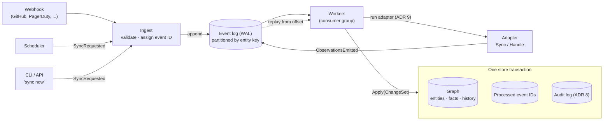
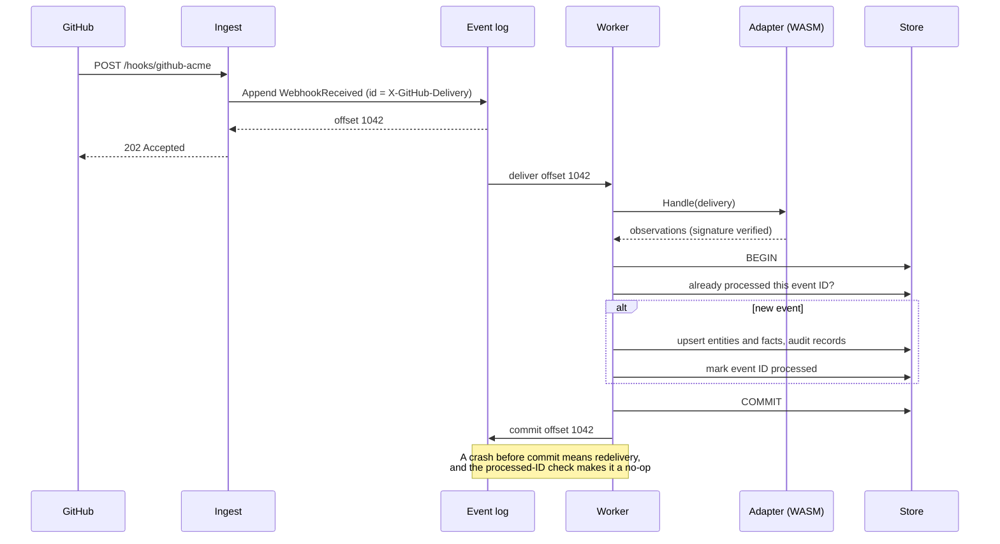

# 7. Bearing is always on and every input is a durable event

Date: 2026-09-29 · Status: proposed

## Context

The scaffold's main path is `bearing adapter sync`: a person runs a command
and observations come out on stdout. A real deployment has to be running all
the time, receiving webhooks and running schedules. A manual sync should
enter the system the same way as everything else.

Turning an event into facts has to be safe to repeat. Webhooks get
redelivered, workers crash halfway, and the scheduled full sync overlaps
with webhooks for the same entities. A lost or double-applied event corrupts
the graph quietly.

## Decision

- **One way in.** Webhook deliveries, scheduled syncs and manual "sync now"
  requests all become events on an **event log**:
  - `SyncRequested`: from the scheduler, the CLI or the API.
  - `WebhookReceived`: the raw delivery, verified by the adapter (ADR 9).
  - `ObservationsEmitted`: adapter output.

  The CLI is a client of the running server. It does not run adapters itself.
- **Write-ahead log.** An input is appended to the event log *before* Bearing
  acknowledges it (the webhook gets its 2xx only after the append). The log
  is the WAL: every fact can be traced to the event that produced it, and
  replaying the log rebuilds the graph.
- **`EventLog` replaces the `EventBus` contract.** It is durable, ordered
  within a partition and replayable from an offset:
  `Append`, `Read(from offset)` for a consumer group, `Commit`.
  Partitions are keyed by source entity key, so events about one entity stay
  in order.
- **Idempotent, transactional apply.** Each event has a stable ID (the
  source's delivery ID when it has one, otherwise a hash of its content).
  `GraphStore` gains `Apply(ChangeSet)`, which writes the entities, facts and
  retractions from one event **and** records that event ID as processed, in
  one transaction. A redelivered event finds its ID already recorded and
  changes nothing.
- **Backends.** The default is a log table in the same store as the graph
  (ADR 5), so a single binary needs nothing else. NATS JetStream is the
  option for scale, and Kafka is an alternative. All three pass one
  `conformance.EventLog` suite.
- **Retention.** Raw events are kept for a configurable window (default 30
  days) for replay and debugging. Facts and their history are kept
  indefinitely, and the graph can be rebuilt from a full resync plus the
  retained window.

## Shape

Every input takes the same path. Nothing is acknowledged until it is in the
log, and nothing is applied twice.

A webhook delivery, end to end:

## Consequences

- `bearing adapter sync` becomes an adapter-author tool (a test harness that
  runs one adapter in memory and prints what it would emit). It is no
  longer the product's main path.
- A new long-running `bearing server` process: ingest (HTTP), scheduler,
  workers and API.
- The `GraphStore` contract and its conformance suite gain `Apply` and its
  idempotency tests. `memstore` and `surrealstore` implement them.
- Every fact records the event ID that produced it, which links the graph,
  the log and the audit log (ADR 8).
- Supersedes the `EventBus` row in `docs/spec/contracts.md`.
