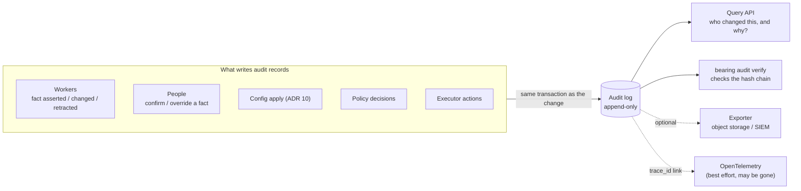
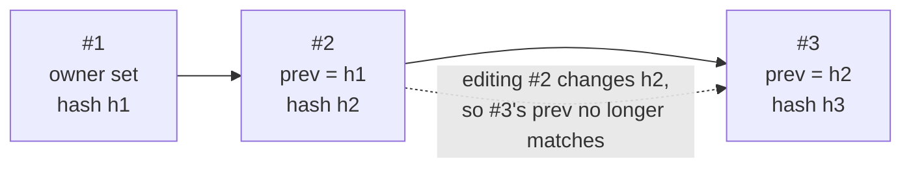

# 8. A dedicated audit log, separate from telemetry

Date: 2026-09-29 · Status: proposed

## Context

OpenTelemetry signals (ADR 4) are for operating Bearing. They can be
sampled, dropped under load, and kept only as long as the telemetry backend
chooses. They can't answer "who changed this owner, and why?" or "which
policy allowed this rollback?" with certainty.

Bearing will record decisions that people rely on (who owns what, who is on
call) and, later, take actions (rollbacks, access grants). Both need a
record that can't be lost or quietly edited.

## Decision

- **An `AuditLog` contract** with `Append(Record)` and `Query(filter)`. There
  is no update or delete.
- **What gets recorded:**
  - A fact asserted, changed or retracted: the event ID, the rule or judge
    score that decided it, and the old and new values.
  - A person confirming or overriding a fact.
  - A configuration change (ADR 10).
  - A policy decision.
  - An action run by the `Executor`: who asked, what was planned, the
    outcome and any rollback.
- **Record shape** (Protobuf, ADR 6): time, actor (person, agent or system
  component), action, target, before/after references, reason, the event ID
  and the trace ID.
- **Tamper evidence.** Each record includes a hash of the previous record, so
  a gap or an edit breaks the chain. `bearing audit verify` checks the
  chain.
- **Storage.** The default is an append-only table in the main store,
  written in the same transaction as the change it describes: no change
  without its record. An optional exporter streams records to object
  storage or a SIEM for long-term retention.
- **Telemetry stays separate.** Audit records carry the trace ID, so an
  investigation can jump to the trace while it still exists, but the audit
  log never depends on telemetry.

## Shape

Audit records are written by the things that change state, in the same
transaction as the change, and form a hash chain.

## Consequences

- Fact history (in the graph) answers "what was true when". The audit log
  answers "who or what made it so, and why". They reference each other by
  event ID.
- Audit writes add a small cost to every graph transaction. Worth it: it is
  one extra row in a transaction that already happens.
- Retention and privacy: records name people. Retention is configurable, and
  exports must respect the organization's data rules.
- New `conformance.AuditLog` suite: append-only, ordering, and the hash chain
  breaking on tampering.
