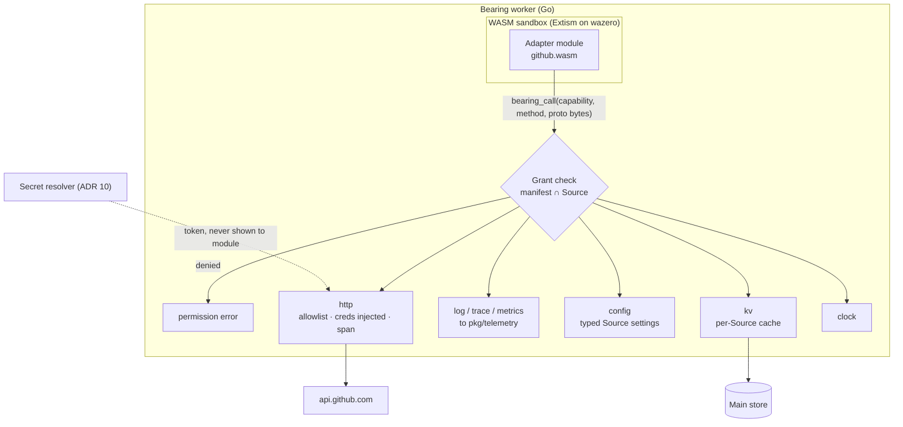
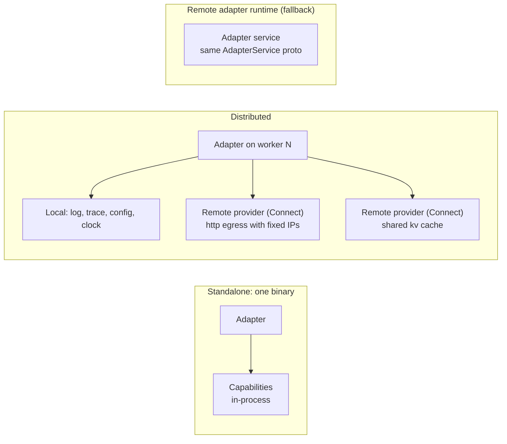

# 9. Adapters run as sandboxed WebAssembly modules with granted capabilities

Date: 2026-09-29 · Status: proposed

## Context

[ADR 3](0003-adapter-protocol.md) made each adapter a separate executable
speaking JSON-RPC on stdio. That keeps adapters independent of the core's
language, but:

- An adapter process can do anything its OS user can: read files, open any
  network connection, run programs. Operators have to trust every adapter
  binary fully.
- Running an adapter means managing a child process per adapter per host,
  which fits poorly with an always-on, horizontally scaled core (ADR 7).
- Distributing adapters means per-platform binaries.

| Option | Pros | Cons |
| --- | --- | --- |
| Processes on stdio (today) | Any language, any library | No sandbox; process management; per-platform builds |
| WASM via Extism (wazero, pure Go) | Sandbox by default; one portable `.wasm` per adapter; runs in-process, so any worker can run any adapter; no CGO | Network only through host functions; some SDKs don't compile to WASM yet; Go adapters need TinyGo or Go's `wasip1` target |
| WASM via wasmtime (component model, WASI 0.2) | Richest standard (`wasi:http`) | CGO; the Go tooling for components is immature |
| Remote adapters over gRPC | Any language, any library, scales separately | The operator runs and secures another service |
| Adopt wasmCloud | Mature capability-provider model; WIT interfaces; distributed "lattice" over NATS | Its own runtime (Rust, wasmtime), scheduler and deployment model to operate; hard to fit a single Bearing binary; less control over what adapters can reach |

wasmCloud's central idea is worth keeping even without wasmCloud itself: the
sandbox exposes nothing but a small set of standard **capabilities**, each a
narrow interface, and an operator grants them per component. That gives
adapters a consistent surface to build against and gives Bearing one place
to implement shared behavior such as logging, tracing, caching and
credential handling.

## Decision

- **The adapter interface is a Protobuf service** (ADR 6): `Describe`,
  `Sync` (cursor paged) and `Handle` (webhook). Messages cross every
  boundary as Protobuf bytes.
- **The default runtime is WASM, hosted with Extism** on wazero (pure Go, no
  CGO). An adapter ships as one `.wasm` module plus a manifest.
- **Adapters reach the world only through host capabilities.** Bearing
  defines a small, versioned set of capabilities. Each one is a Protobuf
  service (ADR 6) in `proto/bearing/capability/<name>/v1/`:

  | Capability | What it gives an adapter | What the host adds |
  | --- | --- | --- |
  | `http` | Outbound HTTP requests | Host allowlist; credentials injected from secret references, so the adapter never sees tokens; an `otelhttp` span; rate-limit handling |
  | `log` | Structured logs | Routed to `pkg/telemetry` with the adapter, source and trace attached |
  | `trace` | Child spans and attributes | Spans parented to the sync or webhook trace |
  | `metrics` | Counters and gauges declared in the manifest | Prefixed and labelled per adapter and source |
  | `config` | This source's typed settings (ADR 10) | Already validated at apply time |
  | `kv` | A small key-value cache (ETags, lookups) with TTLs | Scoped to one source; stored in the main store |
  | `clock` | Current time | Controllable in tests |

  An adapter calls every capability through one host function,
  `bearing_call(capability, method, request_bytes) -> response_bytes`. New
  capabilities need no new ABI.
- **Capabilities are granted, not assumed.** Access is deny-by-default at
  two levels:
  - The adapter's manifest declares which capabilities it needs and their
    scope, for example `http: [api.github.com]`, `kv`, `log`. A module that
    calls anything else gets a permission error.
  - Each `Source` (ADR 10) can narrow that further, but never widen it. For
    example, a source could use a GitHub Enterprise host or turn off `kv`.

  Bearing shows the effective grant before a source is applied, so an
  operator reviews exactly what an adapter will be able to do.
- **Local or remote, same interface.** In a single binary, capabilities are
  in-process host functions. In a distributed install, a capability can be
  served by a separate provider service over Connect, for example a shared
  HTTP egress proxy with fixed IPs or a shared cache. Adapters can't tell the
  difference, which keeps standalone and distributed installs one design.
- **Stay close to WASI.** Where a WASI 0.2 interface exists (`wasi:http`,
  `wasi:logging`, `wasi:keyvalue`, `wasi:config`), our capability follows its
  shape and names. If Go's component-model tooling matures, we can move to
  WIT components, and wasmCloud interoperability stays possible, without
  redesigning the capabilities.
- **Modules are pinned by digest** (sha256) in configuration (ADR 10), and
  can be signed and verified (Sigstore) before loading.
- **A second runtime for what WASM can't do yet.** Remote adapters implement
  the same Protobuf service over Connect/gRPC and run as their own service.
  The core can't tell the difference. This covers adapters that need
  libraries that don't compile to WASM, or special network access.
- **The stdio JSON-RPC transport is retired.** Existing adapters (GitHub)
  are ported to WASM.

## Shape

An adapter module sees one function, `bearing_call`. Everything behind it is
Bearing's, and every call is checked against the grant.

The same interfaces work standalone and distributed. Only where a capability
runs changes.

## Consequences

- **Spike first:** build the GitHub adapter as a WASM module, and check the
  AWS SDK for Go v2 against the host HTTP function (a custom
  `http.RoundTripper`). If the AWS SDK can't be made to work, the AWS
  adapter uses the remote runtime. The decision doesn't depend on it.
- WASM doesn't make Bearing scale by itself. It helps because adapters
  become cheap, stateless functions that any worker can run, so scale comes
  from the event log and worker pool (ADR 7).
- Transports narrow rather than widen: adapters can use only the capabilities
  the host offers. A new transport or feature is added once, as a capability,
  and every adapter that is granted it can use it.
- Shared behavior lives in capabilities, not in each adapter: retries,
  rate limiting, caching, credentials and telemetry are written once in Go
  and behave the same for every adapter in every language.
- Bearing publishes a small SDK per language (Go and Rust first) that wraps
  `bearing_call` with typed clients generated from the capability protos,
  built on the Extism PDKs.
- Each capability gets a conformance suite, so a remote provider behaves the
  same as the in-process one.
- Supersedes [ADR 3](0003-adapter-protocol.md) and
  `docs/spec/adapter-protocol.md` once accepted.
