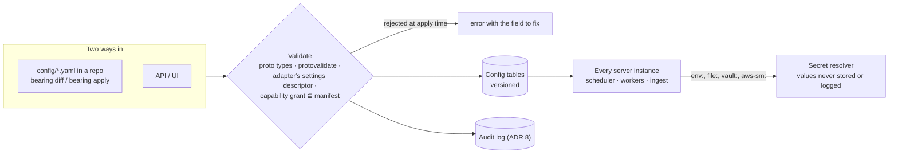
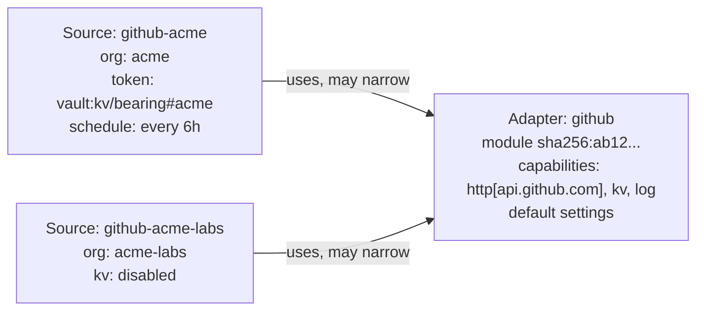

# 10. Configuration is declarative resources, applied and versioned

Date: 2026-09-29 · Status: proposed

## Context

An organization may run dozens of adapter instances (a GitHub adapter per
org, AWS per account, PagerDuty per subaccount), each with settings,
secrets, schedules and permissions. A single config file with flags and
environment variables won't scale, can't be reviewed, and gives no history
of who changed what.

## Decision

- **Configuration is a set of typed resources** in the familiar
  `apiVersion` / `kind` / `metadata` / `spec` shape, each defined as a
  Protobuf message (ADR 6):
  - `Adapter`: a module (ADR 9), pinned by digest, with the capabilities
    it declares and the secret names it needs.
  - `Source`: one configured instance of an adapter, with its settings,
    secret references, schedule and any narrowing of the adapter's
    capability grant. For example, `github-acme` uses the
    GitHub adapter for the `acme` org.
  - `Schedule`, `Policy` and `Retention` resources follow the same pattern
    as they are needed.
- **Adapters type their own settings.** Each adapter's `Describe` returns
  its settings as a Protobuf message descriptor. `Source.spec.settings` is
  checked against it, plus protovalidate rules, when it is applied, so bad
  config fails at apply time, not at 3 a.m. during a sync.
- **Secrets are references, never values:** `env:GITHUB_TOKEN`,
  `file:/run/secrets/x`, `vault:kv/bearing#github`, `aws-sm:<arn>`. A
  `SecretResolver` contract resolves them at run time. Resolved values are
  never stored or logged.
- **Two ways to change configuration, one store:**
  - `bearing apply -f config/`: GitOps. Files in a repository are diffed
    against the running state and applied. `bearing diff` previews the
    change.
  - The API: for UIs and automation.

  Both write to the configuration tables in the main store, and every
  change is versioned and recorded in the audit log (ADR 8).
- **Defaults and overlays.** An `Adapter` can carry default settings that each
  `Source` overrides, so a hundred GitHub orgs share one definition.

## Shape

How the resources relate:

## Consequences

- One new CLI verb family (`apply`, `diff`, `get`) that talks to the
  server's API.
- Config lives in the store, so every server instance sees the same
  configuration without shared files.
- The single-binary quick start can load a directory of config files on
  start-up (`bearing server --config ./config`) and apply them, so trying
  Bearing still needs no API calls.
- Schema evolution follows Protobuf rules: fields are added, not changed,
  and `buf breaking` guards them.
