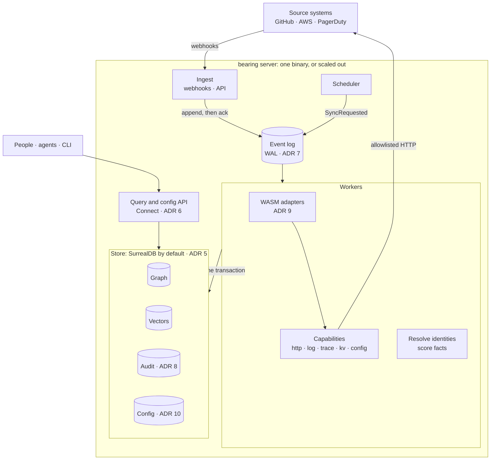

# Proposed architecture (ADRs 6–10)

How the proposals in [ADR 6](adr/0006-protobuf-contracts.md) through
[ADR 10](adr/0010-configuration-as-resources.md) fit together. This is a
proposal; the current code still follows ADRs 1–5.

Protobuf ([ADR 6](adr/0006-protobuf-contracts.md)) defines every arrow that
crosses a component boundary: events on the log, the adapter interface,
capabilities, config resources, audit records and the query API.

| Concern | Standalone | Distributed |
| --- | --- | --- |
| Event log | Table in the store | NATS JetStream (or Kafka) |
| Store | Embedded or single SurrealDB | SurrealDB cluster, or split graph and vectors |
| Adapters | In-process WASM | WASM on any worker; remote adapters for what WASM can't host |
| Capabilities | In-process | In-process, or remote providers (shared egress, cache) |
| Config | `bearing server --config ./config` | `bearing apply` / API into the store |
